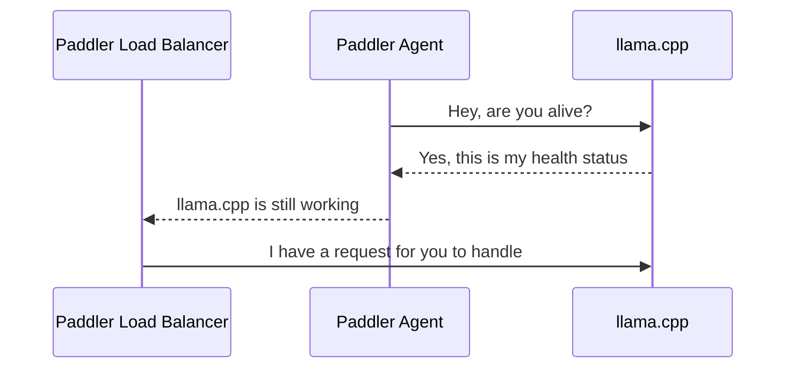

# Paddler

Paddler is an open-source load balancer and reverse proxy designed specifically for optimizing servers running [llama.cpp](https://github.com/ggerganov/llama.cpp). 

Typical strategies like round robin or least connections are not effective for [llama.cpp](https://github.com/ggerganov/llama.cpp) servers, which need slots for continuous batching and concurrent requests. 

Paddler overcomes this by maintaining a stateful load balancer that is aware of each server's available slots, ensuring efficient request distribution. Additionally, Paddler uses agents to monitor the health of individual [llama.cpp](https://github.com/ggerganov/llama.cpp) instances, providing feedback to the load balancer for optimal performance. Paddler also supports the dynamic addition or removal of [llama.cpp](https://github.com/ggerganov/llama.cpp) servers, enabling integration with autoscaling tools.

## How it Works

### Registering llama.cpp Instances

The sequence repeats for each agent. Agents should be installed alongside llama.cpp instance to report their health status to the load balancer.



## Tutorials

- [Installing llama.cpp on AWS EC2 CUDA Instance](tutorial-installing-llamacpp-aws-cuda.md)

## Usage

### Installation

You can download the latest release from the 
[releases page](https://github.com/distantmagic/paddler/releases).

Alternatively you can build the project yourself. You need `go>=1.21` and
`nodejs` (for dashboard's front-end code) to build the project.

```shell
$ git clone git@github.com:distantmagic/paddler.git
$ cd paddler
$ pushd ./management
$ make esbuild # dashboard front-end
$ popd
$ go build -o paddler
```

### Running Agents

The agent should be installed in the same host as [llama.cpp](https://github.com/ggerganov/llama.cpp).

It needs a few pieces of information:
1. `external-*` tells how the load balancer can connect to the llama.cpp instance
2. `local-*` tells how the agent can connect to the llama.cpp instance
3. `management-*` tell where the agent should report the health status

```shell
./paddler agent \
    --external-llamacpp-host 127.0.0.1 \
    --external-llamacpp-port 8088 \
    --local-llamacpp-host 127.0.0.1 \
    --local-llamacpp-port 8088 \
    --management-host 127.0.0.1 \
    --management-port 8085
```

Replace hosts and ports with your own server addresses when deploying.

### Running Load Balancer

Load balancer collects data from agents and exposes reverse proxy to the outside world.

It requires two sets of flags:
1. `management-*` tells where the load balancer should listen for updates from agents
2. `reverseproxy-*` tells how load balancer can be reached from the outside hosts

```shell
./paddler balancer \
    --management-host 127.0.0.1 \
    --management-port 8085 \
    --reverseproxy-host 196.168.2.10 \
    --reverseproxy-port 8080
```

`management-host` and `management-port` in agents should be the same as in the load balancer.

You can enable dashboard to see the status of the agents with 
`--management-dashboard-enable=true` flag. If enabled it is available at the 
management server address under `/dashboard` path.

## Roadmap

- [x] [llama.cpp](https://github.com/ggerganov/llama.cpp) reverse proxy
- [x] Basic load balancer
- [x] Circuit breaker
- [ ] [OpenTelemetry](https://opentelemetry.io/) observer
- [ ] Integration with AWS Auto Scaling (and other cloud providers) - out of 
    the box endpoint with a custom metric to scale up/down

## Community

Discord: https://discord.gg/kysUzFqSCK
