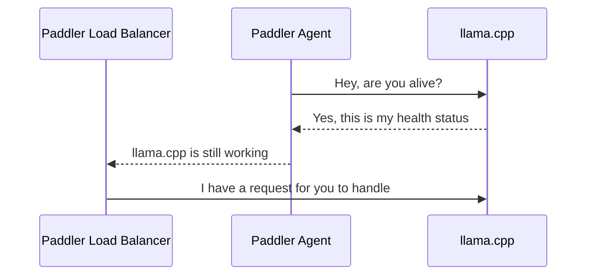

# Paddler

llama.cpp load balancer and reverse proxy

## How it Works

### Registering llama.cpp Instances

The sequence repeats for each agent. Agents should be installed alongside llama.cpp instance to report their health status to the load balancer.

## Roadmap

- [x] [llama.cpp](https://github.com/ggerganov/llama.cpp) reverse proxy
- [x] Basic load balancer
- [x] Circuit breaker
- [ ] [OpenTelemetry] observer
- [ ] Integration with AWS Auto Scaling (and other cloud providers) - out of 
    the box endpoint with custom metric to scale up/down

## Community

Discord: https://discord.gg/kysUzFqSCK
