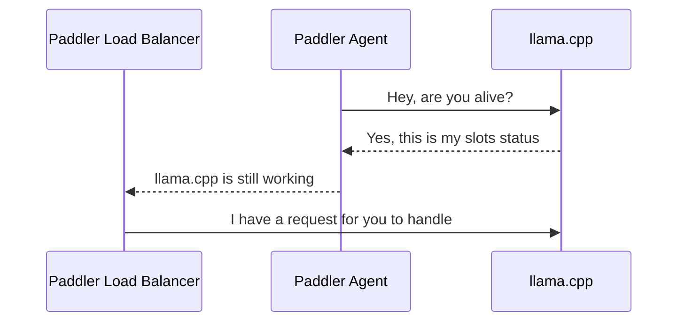

# Paddler

Paddler is an open-source, production-ready, stateful load balancer and reverse proxy designed to optimize servers running [llama.cpp](https://github.com/ggerganov/llama.cpp).

## Why Paddler


Typical load balancing strategies like round robin and least connections are ineffective for llama.cpp servers, which utilize continuous batching algorithms and allow to configure slots to handle multiple requests concurrently. 

Paddler is designed to support llama.cpp-specific features like slots. It works by maintaining a stateful load balancer aware of each server's available slots, ensuring efficient request distribution.

> [!NOTE]
> In simple terms, the `slots` in llama.cpp refer to predefined memory slices within the server that handle individual requests. When a request comes in, it is assigned to an available slot for processing. They are predictable and highly configurable.
>
> You can learn more about them in [llama.cpp server](https://github.com/ggerganov/llama.cpp/tree/master/examples/server) documentation.

## Key features
* Uses agents to monitor the slots of individual llama.cpp instances.
* Supports the dynamic addition or removal of llama.cpp servers, enabling integration with autoscaling tools.
* Buffers requests, allowing to scale from zero hosts.
* Integrates with StatsD protocol but also comes with a built-in dashboard.
* AWS integration.


*Paddler's aware of each server's available slots, ensuring efficient request ("R") distribution*

## How it Works

llama.cpp instances need to be registered in Paddler. Paddler’s agents should be installed alongside llama.cpp instances so that they can report their slots status to the load balancer.

The sequence repeats for each agent:



## Usage

### Installation

Download the latest release for Linux, Mac, or Windows from the 
[releases page](https://github.com/distantmagic/paddler/releases).

On Linux, if you want Paddler to be accessible system-wide, rename the downloaded executable to `/usr/bin/paddler` (or `/usr/local/bin/paddler`).

### Running Agents

The next step is to run Paddler’s agents. Agents register your llama.cpp instances in Paddler and monitor the slots of llama.cpp instances. 
They should be installed on the same host as your server that runs [llama.cpp](https://github.com/ggerganov/llama.cpp).

An agent needs a few pieces of information:
1. `external-*` tells how the load balancer can connect to the llama.cpp instance
2. `local-*` tells how the agent can connect to the llama.cpp instance
3. `management-*` tell where the agent should report the slots status

Run the following to start a Paddler’s agent (replace the hosts and ports with your own server addresses when deploying):

```shell
./paddler agent \
    --external-llamacpp-host 127.0.0.1 \
    --external-llamacpp-port 8088 \
    --local-llamacpp-host 127.0.0.1 \
    --local-llamacpp-port 8088 \
    --management-host 127.0.0.1 \
    --management-port 8085
```

#### Naming the Agents

> [!NOTE]
> Available since v0.6.0

With the `--name` flag, you can assign each agent a custom name. This name will be displayed in the management dashboard and not used for any other purpose. 

### Running Load Balancer

Load balancer collects data from agents and exposes reverse proxy to the outside world.

It requires two sets of flags:
1. `management-*` tells where the load balancer should listen for updates from agents
2. `reverseproxy-*` tells how load balancer can be reached from the outside hosts

To start the load balancer, run:
```shell
./paddler balancer \
    --management-host 127.0.0.1 \
    --management-port 8085 \
    --reverseproxy-host 196.168.2.10 \
    --reverseproxy-port 8080
```

`management-host` and `management-port` in agents should be the same as in the load balancer.

#### Enabling Dashboard

You can enable dashboard to see the status of the agents with 
`--management-dashboard-enable=true` flag. If enabled, it is available at the 
management server address under `/dashboard` path.

## Feature Highlights

### Aggregated Slots Status

Paddler balancer endpoint aggregates the `/slots` endpoints of `llama.cpp` and reports the total number of available and processing slots.


### Buffered Requests (Scaling from Zero Hosts)

> [!NOTE]
> Available since v0.3.0

Load balancer's buffered requests allow your infrastructure to scale from zero hosts by providing an additional metric (requests waiting to be handled). 

It also gives your infrastructure some additional time to add additional hosts. For example, if your autoscaler is setting up an additional server, putting an incoming request on hold for 60 seconds might give it a chance to be handled even though there might be no available llama.cpp instances at the moment of issuing it.

Scaling from zero hosts is especially suitable for low-traffic projects because it allows you to cut costs on your infrastructure—you won't be paying your cloud provider anything if you are not using your service at the moment.


https://github.com/distantmagic/paddler/assets/1286785/34b93e4c-0746-4eed-8be3-cd698e15cbf9

### State Dashboard

Although Paddler integrates with the [StatsD protocol](https://github.com/statsd/statsd), you can preview the cluster's state using a built-in dashboard.


### StatsD Metrics

> [!NOTE]
> Available since v0.3.0

> [!TIP]
> If you keep your stack self-hosted you can use [Prometheus](https://prometheus.io/) with StatsD exporter to handle the incoming metrics.

> [!TIP]
> This feature works with [AWS CloudWatch Agent](https://docs.aws.amazon.com/AmazonCloudWatch/latest/monitoring/CloudWatch-Agent-custom-metrics-statsd.html) as well.

Paddler supports the following StatsD metrics:
- `paddler.requests_buffered` number of buffered requests since the last report (resets after each report)
- `paddler.slots_idle` total idle slots
- `paddler.slots_processing` total slots processing requests

All of them use `gauge` internally.

StatsD metrics need to be enabled with the following flags:

```shell
./paddler balancer \
    # .. put all the other flags here ...
    --statsd-enable=true \
    --statsd-host=127.0.0.1 \
    --statsd-port=8125 \
    --statsd-scheme=http
```

### AWS Integration

> [!NOTE]
> Available since v0.3.0

When running on AWS EC2, you can replace `--local-llamacpp-host` with `aws:metadata:local-ipv4`. In that case, Paddler will use [EC2 instance metadata](https://docs.aws.amazon.com/AWSEC2/latest/UserGuide/ec2-instance-metadata.html) to fetch the local IP address (from the local network):

If you want to keep the balancer management address predictable, I recommend using [Route 53](https://aws.amazon.com/route53/) to create a record that always points to your load balancer (for example `paddler_balancer.example.com`), which makes it something like that in the end:

```shell
./paddler agent \
    --external-llamacpp-host aws:metadata:local-ipv4 \
    --external-llamacpp-port 8088 \
    --local-llamacpp-host 127.0.0.1 \
    --local-llamacpp-port 8088 \
    --management-host paddler_balancer.example.com \
    --management-port 8085
```

## Tutorials

- [Installing llama.cpp on AWS EC2 CUDA Instance](https://llmops-handbook.distantmagic.com/deployments/llama.cpp/aws-ec2-cuda/index.html)
- [Installing llama.cpp with AWS EC2 Image Builder](https://llmops-handbook.distantmagic.com/deployments/llama.cpp/aws-image-builder/index.html)

## Changelog

### v0.6.0

#### Features

- [Name agents with `--name` flag](https://github.com/distantmagic/paddler/issues/15)

### v0.5.0

#### Fixes

- Management server crashed in some scenarios due to concurrency issues

### v0.4.0

Thank you, [@ScottMcNaught](https://github.com/ScottMcNaught), for the help with debugging the issues! :)

#### Fixes

- OpenAI compatible endpoint is now properly balanced (`/v1/chat/completions`)
- Balancer's reverse proxy `panic`ked in some scenarios when the underlying `llama.cpp` instance was abruptly closed during the generation of completion tokens
- Added mutex in the targets collection for better internal slots data integrity

### v0.3.0

#### Features

* Requests can queue when all llama.cpp instances are busy
* AWS Metadata support for agent local IP address
* StatsD metrics support

### v0.1.0

#### Features

* [Aggregated Health Status Responses](https://github.com/distantmagic/paddler/releases/tag/v0.1.0)

## Why the Name

I initially wanted to use [Raft](https://raft.github.io/) consensus algorithm (thus Paddler, because it paddles on a Raft), but eventually, I dropped that idea. The name stayed, though.

Later, people started sending me a "that's a paddlin'" clip from The Simpsons, and I just embraced it.

## Community

Discord: https://discord.gg/kysUzFqSCK
