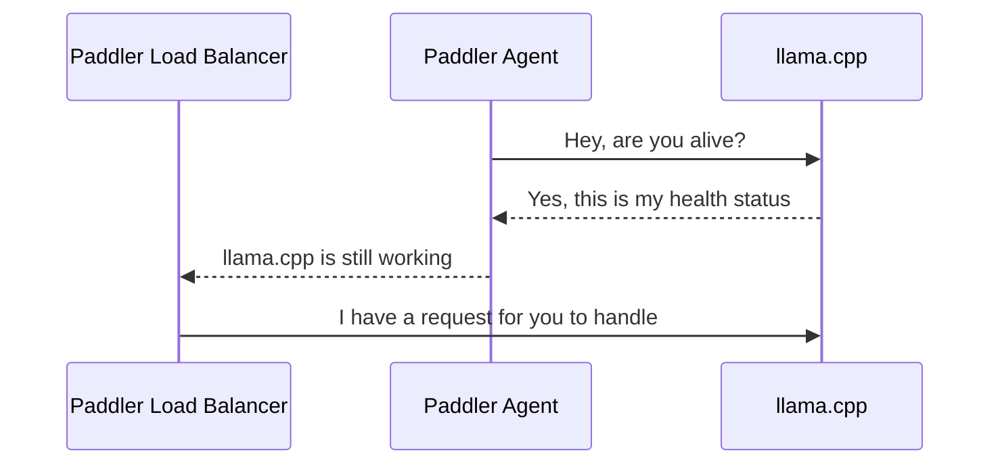

# Paddler

Paddler is an open-source load balancer and reverse proxy designed to optimize servers running [llama.cpp](https://github.com/ggerganov/llama.cpp). 

Typical strategies like round robin or least connections are not effective for [llama.cpp](https://github.com/ggerganov/llama.cpp) servers, which need slots for continuous batching and concurrent requests. 

Paddler overcomes this by maintaining a stateful load balancer that is aware of each server's available slots, ensuring efficient request distribution. Additionally, Paddler uses agents to monitor the health of individual [llama.cpp](https://github.com/ggerganov/llama.cpp) instances, providing feedback to the load balancer for optimal performance. Paddler also supports the dynamic addition or removal of [llama.cpp](https://github.com/ggerganov/llama.cpp) servers, enabling integration with autoscaling tools.

## How it Works

### Registering llama.cpp Instances

The sequence repeats for each agent. Agents should be installed alongside llama.cpp instance to report their health status to the load balancer.



## Tutorials

- [Installing llama.cpp on AWS EC2 CUDA Instance](infra/tutorial-installing-llamacpp-aws-cuda.md)
- [Installing llama.cpp with AWS EC2 Image Builder](infra/tutorial-installing-llamacpp-aws-ec2-image-builder.md)

## Usage

### Installation

You can download the latest release from the 
[releases page](https://github.com/distantmagic/paddler/releases).

Alternatively, you can build the project yourself. You need `go>=1.21` and
`nodejs` (for the dashboard's front-end code) to build the project.

```shell
$ git clone git@github.com:distantmagic/paddler.git
$ cd paddler
$ pushd ./management
$ make esbuild # dashboard front-end
$ popd
$ go build -o paddler
```

### Running Agents

The agent should be installed in the same host as [llama.cpp](https://github.com/ggerganov/llama.cpp).

It needs a few pieces of information:
1. `external-*` tells how the load balancer can connect to the llama.cpp instance
2. `local-*` tells how the agent can connect to the llama.cpp instance
3. `management-*` tell where the agent should report the health status

```shell
./paddler agent \
    --external-llamacpp-host 127.0.0.1 \
    --external-llamacpp-port 8088 \
    --local-llamacpp-host 127.0.0.1 \
    --local-llamacpp-port 8088 \
    --management-host 127.0.0.1 \
    --management-port 8085
```

Replace hosts and ports with your own server addresses when deploying.

### Running Load Balancer

Load balancer collects data from agents and exposes reverse proxy to the outside world.

It requires two sets of flags:
1. `management-*` tells where the load balancer should listen for updates from agents
2. `reverseproxy-*` tells how load balancer can be reached from the outside hosts

```shell
./paddler balancer \
    --management-host 127.0.0.1 \
    --management-port 8085 \
    --reverseproxy-host 196.168.2.10 \
    --reverseproxy-port 8080
```

`management-host` and `management-port` in agents should be the same as in the load balancer.

You can enable dashboard to see the status of the agents with 
`--management-dashboard-enable=true` flag. If enabled it is available at the 
management server address under `/dashboard` path.

## Feature Highlight

### Aggregated Health Status

Paddler overrides `/health` endpoint of `llama.cpp` and reports the total number of available and processing slots.


### AWS Integration

> [!NOTE]
> Available since v0.3.0

When running on AWS EC2, you can replace `--local-llamacpp-host` with `aws:metadata:local-ipv4`. In that case, Paddler will use [EC2 instance metadata](https://docs.aws.amazon.com/AWSEC2/latest/UserGuide/ec2-instance-metadata.html) to fetch the local IP address (from the local network):

If you want to keep the balancer management address predictable, I recommend using [Route 53](https://aws.amazon.com/route53/) to create a record that always points to your load balancer (for example `paddler_balancer.example.com`), which makes it something like that in the end:

```shell
./paddler agent \
    --external-llamacpp-host paddler_balancer.example.com \
    --external-llamacpp-port 8088 \
    --local-llamacpp-host aws:metadata:local-ipv4 \
    --local-llamacpp-port 8088 \
    --management-host paddler_balancer.example.com \
    --management-port 8085
```

### Buffered Requests (Scaling from Zero Hosts)

> [!NOTE]
> Available since v0.3.0

Load balancer's buffered requests allow your infrastructure to scale from zero hosts by providing an additional metric (requests waiting to be handled). 

It also gives your infrastructure some additional time to add additional hosts. For example, if your autoscaler is setting up an additional server, putting an incoming request on hold for 60 seconds might give it a chance to be handled even though there might be no available llama.cpp instances at the moment of issuing it.


https://github.com/distantmagic/paddler/assets/1286785/34b93e4c-0746-4eed-8be3-cd698e15cbf9

### State Dashboard

Although Paddler integrates with the [StatsD protocol](https://github.com/statsd/statsd), you can preview the cluster's state using a built-in dashboard.


### StatsD Metrics

> [!NOTE]
> Available since v0.3.0

> [!TIP]
> If you keep your stack self-hosted you can use [Prometheus](https://prometheus.io/) with StatsD exporter to handle the incoming metrics.

> [!TIP]
> This feature works with [AWS CloudWatch Agent](https://docs.aws.amazon.com/AmazonCloudWatch/latest/monitoring/CloudWatch-Agent-custom-metrics-statsd.html) as well.

Paddler supports the following StatsD metrics:
- `paddler.requests_buffered` number of buffered requests since the last report (resets after each report)
- `paddler.slots_idle` total idle slots
- `paddler.slots_processing` total slots processing requests

All of them use `gauge` internally.

StatsD metrics need to be enabled with the following flags:

```shell
./paddler balancer \
    # .. put all the other flags here ...
    --statsd-enable=true \
    --statsd-host=127.0.0.1 \
    --statsd-port=8125 \
    --statsd-scheme=http
```

## Changelog

### v0.3.0

#### Features

* Requests can queue when all llama.cpp instances are busy
* AWS Metadata support for agent local IP address
* StatsD metrics support

### v0.1.0

#### Features

* [Aggregated Health Status Responses](https://github.com/distantmagic/paddler/releases/tag/v0.1.0)

## Community

Discord: https://discord.gg/kysUzFqSCK
