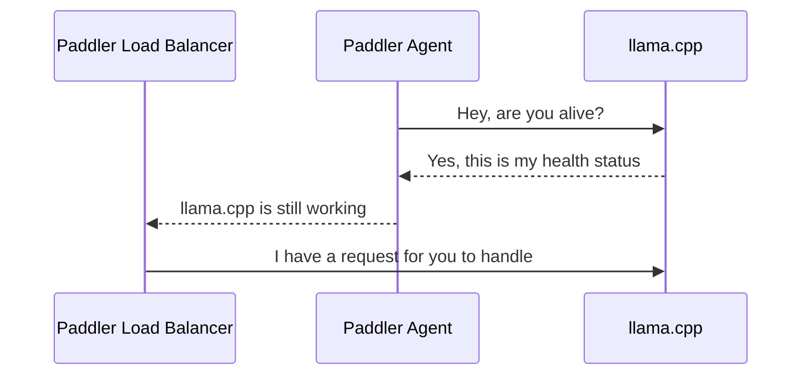

# Paddler

Paddler is an open-source load balancer and reverse proxy designed specifically for optimizing servers running [llama.cpp](https://github.com/ggerganov/llama.cpp). 

Typical strategies like round robin or least connections are not effective for [llama.cpp](https://github.com/ggerganov/llama.cpp) servers, which need slots for continuous batching and concurrent requests. 

Paddler overcomes this by maintaining a stateful load balancer that is aware of each server's available slots, ensuring efficient request distribution. Additionally, Paddler uses agents to monitor the health of individual [llama.cpp](https://github.com/ggerganov/llama.cpp) instances, providing feedback to the load balancer for optimal performance. Paddler also supports the dynamic addition or removal of [llama.cpp](https://github.com/ggerganov/llama.cpp) servers, enabling integration with autoscaling tools.

## How it Works

### Registering llama.cpp Instances

The sequence repeats for each agent. Agents should be installed alongside llama.cpp instance to report their health status to the load balancer.



## Usage

### Running Agents

The agent should be installed in the same host as [llama.cpp](https://github.com/ggerganov/llama.cpp).

```shell
./paddler agent \
    # external: how loadbalancer can connect to the llama.cpp instance
    --external-llamacpp-host 192.168.1.50 \
    --external-llamacpp-port 8088 \
    # local: how agent can connect to the llama.cpp instance
    --local-llamacpp-host 127.0.0.1 \
    --local-llamacpp-port 8088 \
    # management: where agent should report the health status
    --management-host 196.168.1.10 \
    --management-port 8080
```

### Running Load Balancer

Load balancer collects data from agents and exposes reverse proxy to the outside world.

```shell
./paddler balancer \
    # management: server that receives updates from agents
    --management-host 192.168.1.10 \
    --management-port 8088 \
    # reverseproxy: endpoint for external services
    --reverseproxy-host 196.168.2.10 \
    --reverseproxy-port 8080
```

## Roadmap

- [x] [llama.cpp](https://github.com/ggerganov/llama.cpp) reverse proxy
- [x] Basic load balancer
- [x] Circuit breaker
- [ ] [OpenTelemetry](https://opentelemetry.io/) observer
- [ ] Integration with AWS Auto Scaling (and other cloud providers) - out of 
    the box endpoint with a custom metric to scale up/down

## Community

Discord: https://discord.gg/kysUzFqSCK
The sequence repeats for each agent. Agents should be installed alongside llama.cpp instance to report their health status to the load balancer.
